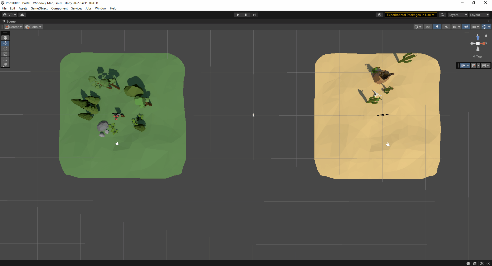

# Portal + URP + VR
Portal effect using UniversalRP (VR compatible).
This project has been inspired on [Coding Adventure: Portals](https://www.youtube.com/watch?v=cWpFZbjtSQg&ab_channel=SebastianLague) implementation.

The [Portals project](https://www.youtube.com/watch?v=cWpFZbjtSQg&ab_channel=SebastianLague) was made using Built-in Render Pipeline; This project was made by using Universal RP that takes advantage of using Scriptable Render Features which allows to inject render passes into the render loop.
 
In the [ScriptableRendererFeature](https://docs.unity3d.com/Packages/com.unity.render-pipelines.universal@16.0/api/UnityEngine.Rendering.Universal.ScriptableRendererFeature.html), you can configure the information that requires the [ScriptableRenderPass](https://docs.unity3d.com/Packages/com.unity.render-pipelines.universal@16.0/api/UnityEngine.Rendering.Universal.ScriptableRenderPass.html). Also, you can specify the event in which the pass will be enqueued, if this pass will be executed, and in which cameras the effect will be applied, among other actions that you can define according to your needs.
 
In the [ScriptableRenderPass](https://docs.unity3d.com/Packages/com.unity.render-pipelines.universal@16.0/api/UnityEngine.Rendering.Universal.ScriptableRenderPass.html), you can perform all your graphics tasks by using [command buffers](https://docs.unity3d.com/ScriptReference/Rendering.CommandBuffer.html).

###### Current support: Unity 2022.3.4f1, Universal RP 14.0.8, xr.oculus 4.0.0, and XR interaction toolkit 2.4.3

**Usage of the project**
* Clone the repository or download the zip to use this project locally.
* Load the project using Unity 2022.3.4f1 or superior.
* Open the _Portal_ scene located at **Assets/Scenes**
* Enter to Play mode

# Demo running on Meta Quest 2:

# High level description

To achieve the Portal effect, a couple of [ScriptableRendererFeatures](https://docs.unity3d.com/Packages/com.unity.render-pipelines.universal@16.0/api/UnityEngine.Rendering.Universal.ScriptableRendererFeature.html) were implemented with their respective [ScriptableRenderPasses](https://docs.unity3d.com/Packages/com.unity.render-pipelines.universal@16.0/api/UnityEngine.Rendering.Universal.ScriptableRenderPass.html). A high-level implementation is described below:

1. The Portal scene contains two cameras. Each camera has a priority, with the PortalCamera having the highest priority (0) and the MainCamera having the lowest (-1).
This allows rendering first the portal scene and then the main scene.

2. The first process stores in a Render Texture from the Portal Camera perspective. The CopyTextureRenderFeature is in charge of performing this operation.

3. Then, when the GrabTextureRenderFeature is executed, it grabs the temporary render texture created in the previous step and Blit it into a Material.

Files to take into account for achieving this:
* C# file(s):
    * Graphics:
        * [CopyTextureRenderFeature](Assets/Scripts/Graphics/RendererFeatures/CopyTextureRenderFeature.cs) and [CopyTexturePass](Assets/Scripts/Graphics/RendererFeatures/CopyTexturePass.cs): Classes in charge of generating a temporary VR-capable render texture.
        * [GrabTextureRenderFeature](Assets/Scripts/Graphics/RendererFeatures/GrabTextureRenderFeature.cs) and [GrabTexturePass](Assets/Scripts/Graphics/RendererFeatures/GrabTexturePass.cs):  Classes in charge of retrieving and blitting the temporary render texture in a specific Quad in the scene.
    * Behaviors:
        * [PortalController](Assets/Scripts/Portal/PortalController.cs): This behavior controls the transformation of the PortalCamera to match with the position and rotation of the MainCamera.
* Shader(s):
    * [CopyTexture](Assets/Shaders/CopyTexture.shader): This shader is a lightweight version of the Blit.hlsl
    * [GrabTexture](Assets/Shaders/GrabTexture.shader): This shader is responsible for reading a `TEXTURE2D_X` and performing the `ComputeScreenPos` in order to achieve the Portal effect.

# Resources
Thanks for the awesome resources provided by:

* [Low-Poly Simple Nature Pack](https://assetstore.unity.com/packages/3d/environments/landscapes/low-poly-simple-nature-pack-162153) by [JustCreate](https://assetstore.unity.com/publishers/44390).
* [Free Low Poly Desert Pack](https://assetstore.unity.com/packages/3d/environments/free-low-poly-desert-pack-106709) by [23 Space Robots and Counting...](https://assetstore.unity.com/publishers/21779)
